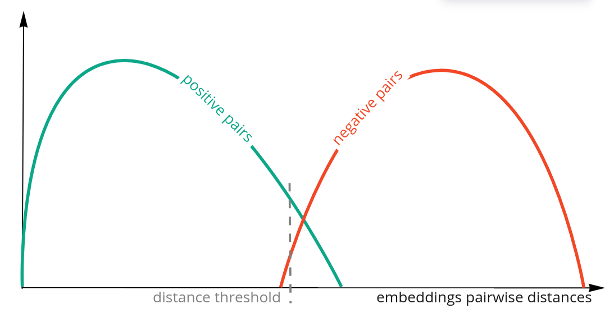
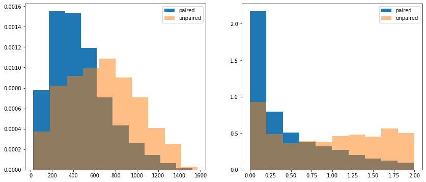

# Data Fusion Contest 2022. Matching
Solutions of Data Fusion 2022 user matching challenge.  
Repository contains 3 solutions (in different branches) with 2 different approaches for user embedding generation.  
All solutions share similar basic idea:  
1. Create feature vectors for users based on transactions or clickstream data.
2. Train siamese neural network with triplet loss.
3. Get user embeddings such as paired users close to each other and unpaired users are distant.
4. Rank match probability based on embeddings distance metric.
5. Assign 0 if pairwise distance is above threshold.  
 

Solutions mainly differ in a way of user feature vector generation.
 
---
 
## Solution 1:
[Solution branch.](https://github.com/kumgleb/data_fusion_matching)
 
| R1 (Harm. Mean)  | MRR @100 | Precision @100 |
| ------------- | ------------- |  ------------- |
|0.0032381007 | 0.0017015599 | 0.0333889816|
 
Embeddings of transactions and clickstream categories were created based on their descriptions.  
User features are calculated as weighted categories embeddings, weights are calculated from the number of category occurrences for specific users.
### Categories embeddings:
1. Translate categories description from RU to EN.
2. Normalize categories description.
3. Create word embeddings.
4. For `mcc_codes.csv` description select only top-k worlds closest to `click_categories.csv` corpus.
5. Create final category embeddings as averaged embeddings of description of k-closest words.
### User embeddings:
1. Calculate the sum of category occurrence.
2. Calculate category weights with softmax from non zero categories.
 
Example can be found in the [notebook.](https://github.com/kumgleb/data_fusion_matching/blob/main/embeddings.ipynb)
 
---
 
## Solution 2:
[Solution branch.](https://github.com/kumgleb/data_fusion_matching/tree/counts)  
 
| R1 (Harm. Mean)  | MRR @100 | Precision @100 |
| ------------- | ------------- |  ------------- |
|0.00746767 | 0.0039526563 | 0.0674457429|
 
User feature vectors are represented as a log of the sum of unique category occurrences (in transactions and clickstream).
 
## Solution 3:
[Solution branch.](https://github.com/kumgleb/data_fusion_matching/tree/counts_ensemble)
 
 
| R1 (Harm. Mean)  | MRR @100 | Precision @100 |
| ------------- | ------------- |  ------------- |
|0.0081377321| 0.0042996904 | 0.0757929883|
 
Is the same as solution 2 but the final embeddings are calculated as an average of embeddings from 5 siamese models trained on 5 folds.
 
---
 
## Analysis:
Such approach does not lead to reliable separation of pairwise distances for positive and negative pairs:

*(Left image - euclidean distance, right image - cosine distance).*

Thus ranking based on pairwise distances appears to be not effective enough. 
 

